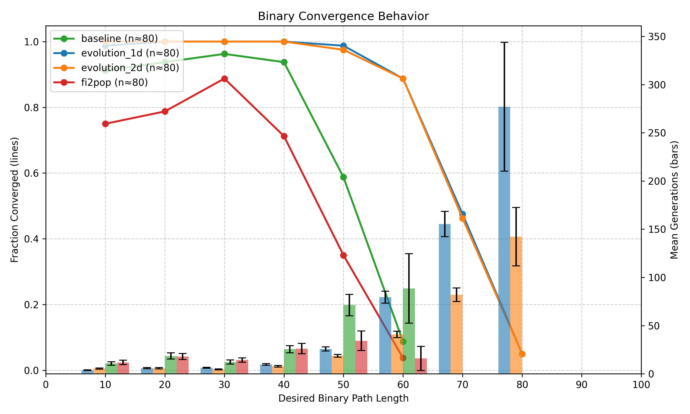
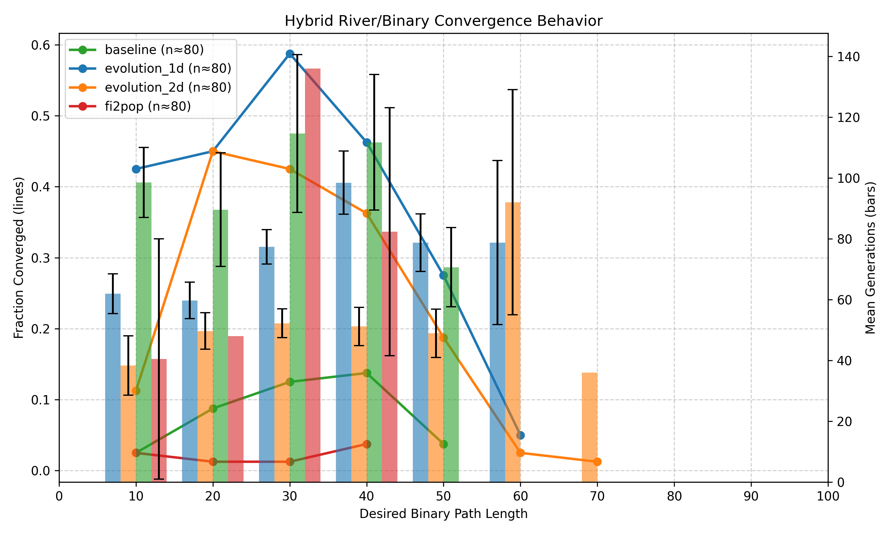

# WFC-MDP: A Markovian Framing of WaveFunctionCollapse for Procedurally Generating Aesthetically Complex Environments

[](https://example.com)
[](LICENSE)
[](https://www.python.org/downloads/)
[](https://gymnasium.farama.org/)
[](https://github.com/psf/black)

## Abstract

Procedural content generation often requires satisfying both designer-specified objectives and adjacency constraints implicitly imposed by the underlying tile set. To address the challenges of jointly optimizing both constraints and objectives, we reformulate WaveFunctionCollapse (WFC) as a Markov Decision Process (MDP), enabling external optimization algorithms to focus exclusively on objective maximization while leveraging WFC's propagation mechanism to enforce constraint satisfaction. We empirically compare optimizing this MDP to traditional evolutionary approaches that jointly optimize global metrics and local tile placement. Across multiple domains with various difficulties, we find that joint optimization not only struggles as task complexity increases, but consistently underperforms relative to optimization over the WFC-MDP, underscoring the advantages of decoupling local constraint satisfaction from global objective optimization.

**Authors:** Franklin Yiu¹, Mohan Lu¹, Nina Li¹, Kevin Joseph¹, Tianxu Zhang¹, Julian Togelius¹, Timothy Merino¹, Sam Earle¹  
¹New York University, United States  


---

## Table of Contents

1. [Introduction](#1-introduction)
2. [Quick Start](#2-quick-start)
3. [Supported Environments](#3-supported-environments)
4. [Supported Methods](#4-supported-methods)
5. [Usage](#5-usage)
6. [API Reference](#6-api-reference)

---

## 1. Introduction

Wave Function Collapse (WFC) is powerful at enforcing local adjacency constraints but offers limited leverage for optimizing global, gameplay‑relevant objectives. We reframe WFC as a Markov Decision Process (WFC‑MDP) so that constraint satisfaction is handled by propagation while external optimizers focus solely on objectives. Using a simple μ+λ Evolution controller, we evaluate this MDP formulation against non‑MDP baselines that operate directly on final maps (including FI‑2Pop). Across binary path‑length tasks, biome objectives, and their combinations, optimizing over the WFC‑MDP yields higher convergence rates and fewer generations than methods that must implicitly learn adjacency. This repo provides a lightweight Gymnasium environment, reward functions for several domains, and scripts to collect convergence data and produce comparison plots.

### Key Innovation: WFC as MDP

- **State S**: boolean belief grid `G ∈ {0,1}^{H×W×n_t}`; a cell is collapsed iff its channel vector is one‑hot; otherwise it is in superposition. We also expose the next‑collapse index.
- **Action A**: length‑`n_t` preference logits over tiles for the next‑collapse cell.
- **Transition T**: collapse the feasible argmax tile and propagate adjacency constraints.
- **Reward R**: sparse terminal reward from a task‑specific objective; contradictions truncate with a large negative value.
- **Discount**: γ = 1.0 (episodic).

Action handling: We softmax logits, zero out infeasible tiles, select among the remaining, then propagate constraints. No explicit action‑mask argument is required.

### Results Summary

We evaluate optimization methods across binary path‑length tasks, biome objectives, and their combinations. **Optimizing over the WFC‑MDP consistently outperforms non‑MDP baselines** (FI‑2Pop, Baseline Evolution) on both convergence rates and sample efficiency. The performance gap widens significantly as task complexity increases.

**Binary Domain:**


**Hybrid River/Binary Domain:**


**Hybrid Plains Binary Domain:**


### Tile Set

All maps and objective functions are constructed based on a subset of *Biome Tileset Pack B - Grassland, Savannah, and Scrubland*. Adjacency rules are generated via manual human labeling, though they could also be extracted from an input image.


*Path tiles are marked in orange, grass tiles in green, water tiles in blue, hill tiles in brown, and the water center tile in light blue. Unused tiles are darkened.*

---

## 2. Quick Start

### 2.1 Installation

```bash
# From the repository root
python -m venv .venv
# Windows
. .venv/Scripts/activate
# macOS/Linux
# source .venv/bin/activate

pip install -r requirements.txt
python -c "import gymnasium; print(gymnasium.__version__)"  # Expect 1.1.1
```

**Requirements:**
- Python 3.10+
- Windows/macOS/Linux
- 8GB RAM minimum recommended

### 2.2 Basic Usage

Minimal example (2-3 minutes on a typical laptop):

```bash
# Evolution (Binary easy)
python plot.py \
  --method evolution \
  --task binary_easy \
  --genotype-dimensions 1 \
  --load-hyperparameters hyperparameters/binary_1d_hyperparameters.yaml \
  --sample-size 5

# Outputs: CSVs under method-specific figure folders, e.g. `figures_evolution/1d/binary_easy_convergence.csv`.
# If you run evolution.py with --save-best-per-gen, best-per-generation images will save under `best_gen_maps/...`.
```

### 2.3 Repository Structure

```
WFC-MDP/
├── assets/
│   ├── biome_adjacency_rules.json         # Tile set definitions and adjacency graph
│   ├── biome_adjacency_rules.py           # Loads rules/images; builds boolean adjacency matrix
│   └── slice_tiles.py                     # Asset slicing/utilities (optional)
├── core/
│   ├── wfc_env.py                         # Gymnasium environment (WFC as MDP wrapper)
│   ├── wfc.py                             # WFC core: initialize, collapse, propagate, render helpers
│   ├── evolution.py                       # μ+λ evolution (1D/2D genotypes), QD hooks, Optuna objective
│   ├── fi2pop.py                          # FI-2Pop and baseline direct-map evolution pipelines
├── tasks/
│   ├── utils.py                           # Grid ops: masks, regions, longest path
│   ├── binary_task.py                     # Binary path-length reward
│   ├── river_task.py                      # River biome reward
│   ├── pond_task.py                       # Pond biome reward
│   ├── grass_task.py                      # Grass biome reward
│   └── hill_task.py                       # Hill biome reward
├── hyperparameters/
│   ├── binary_1d_hyperparameters.yaml     # Evolution params for 1D genotype
│   ├── binary_2d_hyperparameters.yaml     # Evolution params for 2D genotype
│   ├── combo_*_hyperparameters.yaml       # Binary+Biome combined runs
│   ├── fi2pop_*_hyperparameters.yaml      # FI-2Pop/baseline params
│   └── baseline_*_hyperparameters.yaml    # Baseline EA params
├── sbatch/
│   ├── evolution_plots/                   # SLURM scripts to launch plot sweeps
│   ├── fi2pop_plots/                      # SLURM scripts for FI-2Pop/baseline plots
│   ├── mcts_plots/                        # deprecated (MCTS not used)
│   └── baseline_plots/                    # SLURM scripts for baseline comparisons
├── plot.py                                # Data collection (CSV) and plotting/comparisons CLI
├── requirements.txt                       # Python dependencies
└── README.md                              # You are here
```

---

## 3. Supported Environments

Environments define the task objectives and reward functions. All environments use the WFC-MDP formulation with the Biome Tileset Pack B.

| Name | Goal | Flags |
|------|------|-------|
| `binary` | Generate fully connected maps with target path length | `--task binary_hard` |
| `river` | Generate maps with a single contiguous river biome | `--task river` |
| `plains`¹ | Generate open grasslands with minimum grass/flower coverage | `--task grass` |
| `pond` | Generate pond-like water bodies (25-50% water, clustered) | `--task pond` |
| `hill` | Generate hill-enclosed regions | `--task hill` |
| `river + binary` | Combines binary path length and river biome objectives | `--task binary_hard --task river --combo hard` |
| `plains + binary`¹ | Combines binary path length and plains biome objectives | `--task binary_hard --task grass --combo hard` |

¹ We renamed `grass` to `plains` for clarity in the paper, but all code uses `grass`.

### Example Outputs

#### Binary Domain

The binary domain tasks the generator with creating valid maps that achieve an exact target path length. The red line shows the longest shortest path.

<p align="center">
  
  
  
</p>

*Optimizing for target path-lengths in the Binary domain: 40, 50, and 60 tiles.*

#### Biome Domains

<p align="center">
  
  
</p>

*Outputs resulting from the optimization of the River and Plains biome objectives.*

**Notes:** Results/plots in the paper focus on hard variants; pond and hill biomes are available but not included in main experimental comparisons.

---

## 4. Supported Methods

Optimization methods for evolving WFC-MDP action sequences or direct map representations. All methods use evolutionary algorithms with hyperparameters defined in `hyperparameters/*.yaml`.

| Name | Description | Implementation |
|------|-------------|----------------|
| **Evolution (1D)** | Evolves action sequences using μ+λ evolution with sequential genotype (actions applied in order) | `core/evolution.py` |
| **Evolution (2D)** | Evolves action sequences using μ+λ evolution with spatial genotype (actions indexed by next-collapse cell position) | `core/evolution.py` |
| **FI-2Pop** | Feasible-Infeasible Two-Population algorithm maintaining two subpopulations (feasible maximizes objective, infeasible minimizes violations) operating on final maps | `core/fi2pop.py` |
| **Baseline** | Standard evolutionary algorithm with penalized fitness (objective_score - violations) operating on final maps | `core/fi2pop.py` |

---

## 5. Usage

### 5.1 Running Experiments

The main interface is `plot.py`, which can collect convergence data and generate comparison plots.

**Evolution (1D genotype):**
```bash
python plot.py \
  --method evolution \
  --task binary_easy \
  --genotype-dimensions 1 \
  --load-hyperparameters hyperparameters/binary_1d_hyperparameters.yaml \
  --sample-size 20
# → figures_evolution/1d/binary_easy_convergence.csv
```

**Evolution (2D genotype):**
```bash
python plot.py \
  --method evolution \
  --task binary_easy \
  --genotype-dimensions 2 \
  --load-hyperparameters hyperparameters/binary_2d_hyperparameters.yaml \
  --sample-size 20
# → figures_evolution/2d/binary_easy_convergence.csv
```

**FI-2Pop baseline:**
```bash
python plot.py \
  --method fi2pop \
  --task binary_easy \
  --load-hyperparameters hyperparameters/fi2pop_binary_hyperparameters.yaml \
  --sample-size 20
# → figures_fi2pop/binary_convergence.csv
```

**Combined objectives (Binary + River):**
```bash
python plot.py \
  --method evolution \
  --task river \
  --combo hard \
  --genotype-dimensions 1 \
  --load-hyperparameters hyperparameters/combo_river_1d_hyperparameters.yaml \
  --sample-size 20
# → figures_evolution/1d/combo_river_hard_convergence.csv
```

### 5.2 Generating Comparison Plots

Compare multiple methods from CSV files:

```bash
python plot.py --compare \
  --csv-files \
    figures_evolution/1d/binary_easy_convergence.csv \
    figures_fi2pop/binary_convergence.csv \
  --labels Evolution FI-2Pop \
  --title "Binary Easy: Evolution vs FI-2Pop" \
  --output comparison_figures/binary_easy_comparison.png
```

**Tips:**
- For 2D genotypes, set `--genotype-dimensions 2` and load the corresponding `*_2d_hyperparameters.yaml`.
- To remove random offspring in evolution sweeps, use `--no-random-offspring`.
- Debug per-run reward curves can be enabled with `--debug` (PNG saved under `debug_plots/`).

---

## 6. API Reference

### 6.1 Gymnasium Environment API
```python
import numpy as np
from functools import partial
from core.wfc_env import WFCWrapper
from assets.biome_adjacency_rules import create_adjacency_matrix
from tasks.binary_task import binary_reward

adjacency_bool, tile_symbols, tile_to_index = create_adjacency_matrix()
reward_fn = partial(binary_reward, target_path_length=40, hard=True)

env = WFCWrapper(
    map_length=15,
    map_width=20,
    tile_symbols=tile_symbols,
    adjacency_bool=adjacency_bool,
    num_tiles=len(tile_symbols),
    tile_to_index=tile_to_index,
    reward=reward_fn,
    deterministic=True,
)

obs, info = env.reset(seed=42)
for _ in range(env.map_length * env.map_width):
    action = np.random.rand(env.action_space.shape[0])
    obs, reward, terminated, truncated, info = env.step(action)
    if terminated or truncated:
        break
print({"terminated": terminated, "truncated": truncated, **info})
```

### 6.2 Combined Objectives (CombinedReward)
```python
from functools import partial
from core.wfc_env import CombinedReward
from tasks.binary_task import binary_reward
from tasks.river_task import river_reward

reward = CombinedReward([
    partial(binary_reward, target_path_length=40, hard=True),
    river_reward,
])
```
